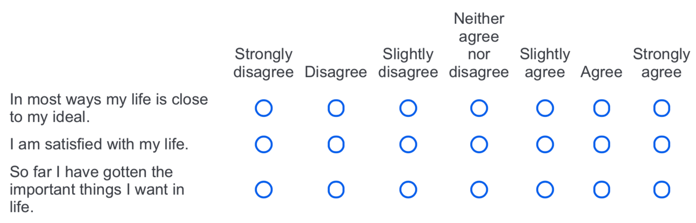
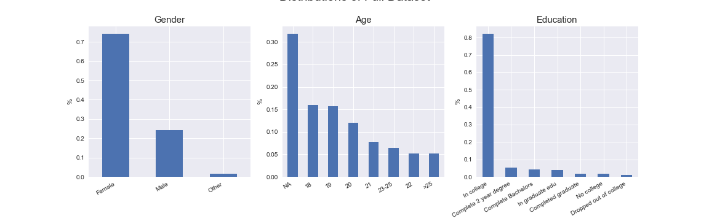

# Emerging Adulthood Measured at Multiple Institutions 2 (EAMMI2)
This project explores a psychological survey of young adults using unsupervised learning techniques. The survey has many sections, covering the attitudes, behaviors, and beliefs surrounding adulthood. 

*Please excuse this readme in progress.*  
The walkthrough of this project can be found in `main/`  
* [EAMMI_1_processing.ipynb](EAMMI_1_processing.ipynb)  
* [EAMMI_2_final.ipynb](EAMMI_2_final.ipynb)

# Table of Contents
[Hypotheses](#hyp) 
[Technology](#tech) 
[Data](#data) 
[Preprocessing](#preprocessing) 
[Conclusion](#conclusion) 

---
---

## Hypotheses
1. The features (survey questions) will reduce to an interpretable set of topics.
2. Holding out the pre-defined "Subjective Well-being" section, the data will still cluster meaningfully around that topic.

## Technology
This project leveraged the Python Data Science stack:
* ScitKit Learn
* Pandas
* Numpy
* Matplotlib
* Jupyter

  

## Data
The data comes from [Open Science Framework](https://osf.io/te54b/), a free and open platform to support research and enable collaboration.

The EAMMI2 is a large scale collaborative project with 32 primary contributors across 32 different locations, with the initial data collection ending in December 2016. 90% of the entries come from the US, with 10% coming from England, Greece, and Grenada.

##### Citation
Grahe, J. E., Faas, C., Chalk, H. M., Skulborstad, H. M., Barlett, C., Peer, J. W., … Reifman, A. (2019, February 21). Emerging Adulthood Measured at Multiple Institutions 2: The Next Generation (EAMMi2). https://doi.org/10.17605/OSF.IO/TE54B 

### In summary
This was a survey given primarily to young adults ages 18-25 regarding their attitudes, behaviors, and beliefs related to Emerging Adulthood. It took about 30 minutes, on average, to complete, and contained around 200 questions, spanning categories such as:
* Markers of Adulthood
* Idea
* Subjective Well-being
* Mindful
* Belonging
* Efficacy
* Support
* Transgressions
* Stress
* Marriage
* Narcissism

Most of the answers were ordinal (e.g. on a scale of 1-7, how likely you agree with a statement) 
Example of Subjective Well-being questions:

  

## Preprocessing
[These cleaning steps](https://docs.google.com/document/d/17Azziyn_q-eKN_BcJ1JdsiU-MNsAH3NBXK6WmSovfPk/edit) were done by the collaborators, which include dropping observations that met the following conditions:
* < 10 minutes to complete
* Completed < 80%
* Missed the "attention" prompts
* High-bias responders

My preprocessing can be found in [EAMMI_1_processing.ipynb](EAMMI_1_processing.ipynb), which included:
* Renaming columns for readability
* Dropping open-ended questions
* Remapping answers to retain ordinality 
* Fill missing values with median
* Binning sparse categories
* Creating target variables for use with supervised learning 

Here is a quick snapshot of the demographics of the cleaned dataset:

  

