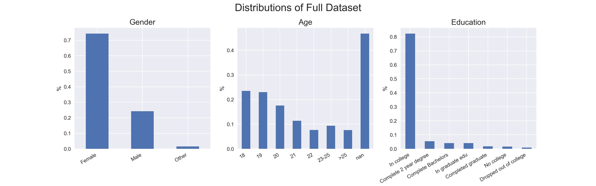
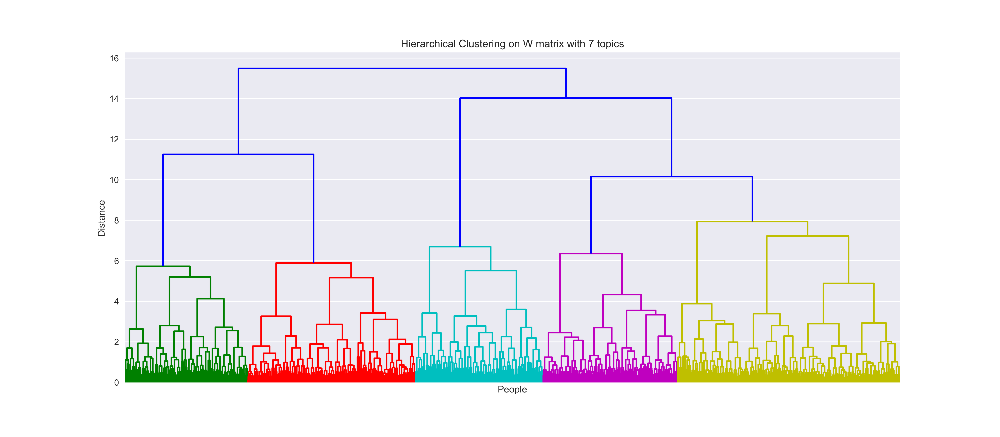

# Emerging Adulthood Measured at Multiple Institutions 2 (EAMMI2)
This project explores a psychological survey of young adults using unsupervised learning techniques. The survey has many sections, covering the attitudes, behaviors, and beliefs surrounding adulthood. 

*Please excuse this readme in progress.*  
The walkthrough of this project can be found in `main/`  
* [EAMMI_1_processing.ipynb](EAMMI_1_processing.ipynb)  
* [EAMMI_2_final.ipynb](EAMMI_2_final.ipynb)

# Table of Contents
[Hypotheses](#hyp) 
[Technology](#tech) 
[Data](#data) 
[Preprocessing](#preprocessing) 
[Execution](#execution) 
[Conclusion](#conclusion) 

---
---

## Hypotheses
1. The features (survey questions) will reduce to an interpretable set of topics.
2. Holding out the pre-defined "Subjective Well-being" section, the data will still cluster meaningfully around that topic.
3. The clusters will contain different demographic distributions

## Technology
This project leveraged the Python Data Science stack:
* ScitKit Learn
* Pandas
* Numpy
* Matplotlib
* Jupyter

  

## Data
The data comes from [Open Science Framework](https://osf.io/te54b/), a free and open platform to support research and enable collaboration.

The EAMMI2 is a large scale collaborative project with 32 primary contributors across 32 different locations, with the initial data collection ending in December 2016. 90% of the entries come from the US, with 10% coming from England, Greece, and Grenada.

##### Citation
Grahe, J. E., Faas, C., Chalk, H. M., Skulborstad, H. M., Barlett, C., Peer, J. W., … Reifman, A. (2019, February 21). Emerging Adulthood Measured at Multiple Institutions 2: The Next Generation (EAMMi2). https://doi.org/10.17605/OSF.IO/TE54B 

### In summary
This was a survey given primarily to young adults ages 18-25 regarding their attitudes, behaviors, and beliefs related to Emerging Adulthood. It took about 30 minutes, on average, to complete, and contained around 200 questions, spanning categories such as:
* Markers of Adulthood
* Idea
* Subjective Well-being
* Mindful
* Belonging
* Efficacy
* Support
* Transgressions
* Stress
* Marriage
* Narcissism

Most of the answers were ordinal (e.g. on a scale of 1-7, how likely you agree with a statement) 
Example of Subjective Well-being questions:

  

## Preprocessing
[These cleaning steps](https://docs.google.com/document/d/17Azziyn_q-eKN_BcJ1JdsiU-MNsAH3NBXK6WmSovfPk/edit) were done by the collaborators, which include dropping observations that met the following conditions:
* < 10 minutes to complete
* Completed < 80%
* Missed the "attention" prompts
* High-bias responders

My preprocessing can be found in [main/EAMMI_1_processing.ipynb](EAMMI_1_processing.ipynb), which included:
* Renaming columns for readability
* Dropping open-ended questions
* Remapping answers to retain ordinality 
* Fill missing values with median
* Binning sparse categories
* Creating target variables for use with supervised learning 

Here is a quick snapshot of the demographics of the cleaned dataset:

  

## Execution
You can find these steps in [main/EAMMI_2_final.ipynb](EAMMI_2_final.ipynb), which includes docstrings and comments/explanations.

#### Use [Non-negative Matrix Factorization](https://mlexplained.com/2017/12/28/a-practical-introduction-to-nmf-nonnegative-matrix-factorization/) for topic extraction.
I found that the reducing the features to seven topics maintained interpretability. Below are the seven topics (the labels are my interpretation) along with a few survey questions associate with each topic. A more comprehensive list of questions can be found in the notebook.

1. Self-worth / Confidence
    1. I can solve most problems if I invest the necessary effort.
    2. I can remain calm when facing difficulties because I can rely on my coping abilities.
    3. I make independent decisions.
2. Mindfulness
    1. It seems I am running on automatic, without much awareness of what I’m doing.
    2. I break or spill things because of carelessness or not paying attention.
    3. I tend not to notice feelings of physical tension until they really grab my attention.
3. Achievement
    1. I am capable of supporting a family financially.
    2. I longer living in parents' household.
    3. I am settled into a long-term career.
4. Family
    1. Marriage is an important aspect of adulthood
    2. Being capable of caring for children is an important aspect of adulthood
    3. Being capable of supporting parents financially is an important aspect of adulthood
5. Support
    1. I get the emotional help and support I need from my family.
    2. There is a special person in my life who cares about my feelings.
    3. I can count on my friends when things go wrong.
6. Self-control / Responsibility
    1. I avoid becoming drunk.
    2. I accept responsibility for my actions.
    3. I use contraception if sexually active and not trying to conceive a child.
7. Neuroticism
    1. My feelings are easily hurt when I feel that others do not accept me.
    2. I feel that I am unable to control the important things in my life.
    3. Is this period of your life a time of feeling stressed out?

#### Use [Hierarchical Clustering](https://youtu.be/vg1w5ZUF5lA?t=453) on reduced feature set
Using Ward's linkage method to minimize within-cluster variance

  

#### Use [Chi-squared test](https://stattrek.com/chi-square-test/independence.aspx) to test independence of the clusters with regards to the held out "Subjective Well-being" questions.
The young adults were binned by their cumulative SWB scores (low, neutral, high), and the distribution of each cluster was tested against that of every other cluster. The p-value is the probability of observing these distributions (or more extreme) given that the clusters are not independent. Therefore, the lower p-values support the claim of independence.

  

